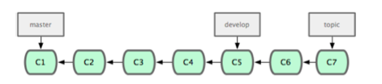
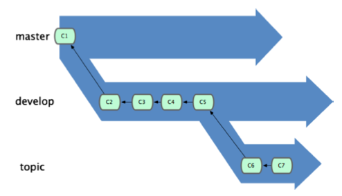
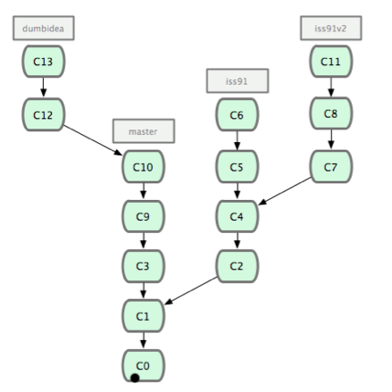
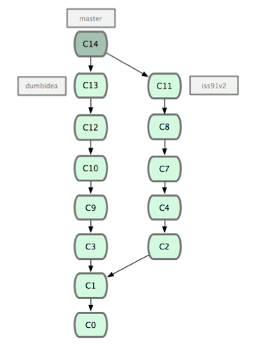
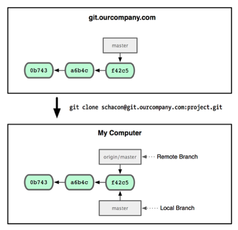
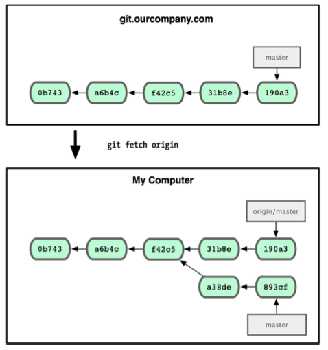

Git Study 05 3.4～3.5
=========

## 3.4 ブランチでの作業の流れ

前回、ブランチとマージの基本操作をやりました。

今回は実際にそれをどう使えばよいかという話し。
- 長期稼働用のブランチ
- トピックブランチ

### 長期稼働用のブランチ

複数のブランチを常にオープンさせておけるGitの特性を活かして、  それぞれのブランチを各開発サイクル用に使う。  
    
- masterブランチに常に安定したコードのみを置き、いつでもリリースできる状態にしておく  
- それ以外に並行してdevelopやnextといった名前のブランチを持ち、 安定性のテストなどにそれらを利用する。  
- developやnextは常に安定している必要はなく、安定した状態になったらmasterにマージする。
- 短期間用にはtopicのようなブランチを作成する。



安定性のレベルに応じて何段階かのブランチを作成し、安定性が一段階上がった時点で  
上位レベルのブランチにマージしていくという考え方。



### トピックブランチ

ブランチの作成、マージ、削除を簡単に行えるGitの特性を活かして、何か特定の機能やそれに関連する作業を行うために使う。

例えば、こんな時  
- masterで何らかの作業中、問題対応のためにiss91ブランチに移動する
- iss91ブランチで作業中、「あ、こっちの方がよかったかも」と新たにiss91v2ブランチを作成
- masterに戻ってしばらく作業中に試したいことができたのでdumbideaブランチを作成

歴史は以下のようになる。



最終的に、  
- iss91vの方を採用したい！  
- あと、dumbideaで試したことをみんなに公開すべきだ！

となり、iss91は破棄し、他２つのブランチをマージした場合



とすぐにブランチを作成した順や作業順に関係なくマージができる！  
注目すべきは、すべてGitのローカルリポジトリ内で完結していて、サーバーとのやりとりをしていないことぉぉ！

## 3.5 リモートブランチ

リモートブランチは、リモートリポジトリ上のブランチの状態を指す。

- ネットワーク上のgit.ourcompany.comにGitサーバーがあるとする
- これをcloneすると、Gitはそれにoriginという名前を付け、それを指すorigin/masterというポインタを作成する
- また、origin/masterと同じ場所をさすmasterブランチを作成する(ここから何らかの作業を始める）



### ローカルのmasterブランチで作業中に、git.ourcompany.comに誰かが更新をかけた場合  

手元での作業を同期させるには以下のコマンドを実行  
```sh
$git fetch origin
```



手元にないデータをすべて取得し、origin/masterが指す先を最新の位置に変更する。  

### 複数のリモートサーバーがある場合

例えば、
-  ネットワーク上にgit.ourcompany.comとは別のgit.team1.ourcompany.comがあるとする
- git remote addで追加、teamoneと命名し参照できるようにする
- git fetch teamoneを実行する
- 手元にないデータをリモートのteamoneサーバーから取得できるようになる

   

### プッシュ

ブランチの内容をみんなと共有したくなった！
```sh
$git push (remote) (branch)
``` 

### 追跡ブランチ

追跡ブランチとは、リモートブランチと直接のつながりを持つローカルブランチのこと。  
追跡ブランチ上で、git push や git pull を実行すると、リモート参照先に対して自動的に処理を行う  

※あるリポジトリをcloneしたら、自動的にmasterブランチを作成し、origin/masterを追跡する。  
これが、git push や git pull が引数なしでもうまく動作する理由。

必要に応じてそれ以外の追跡ブランチを作成することが可能  
```sh
$git checkout --track [remotename]/[branch]
``` 

### リモートブランチの削除

作業終了したった、リモートブランチを削除したい！
```sh
$git push [remotename] :[branch]
```
  

終わり
  
  
