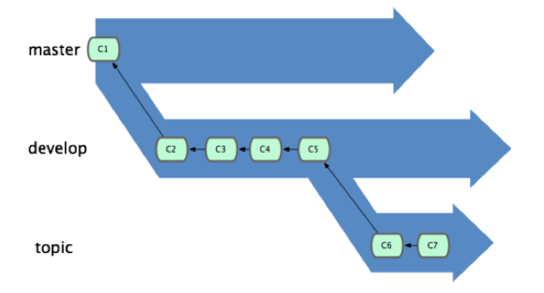
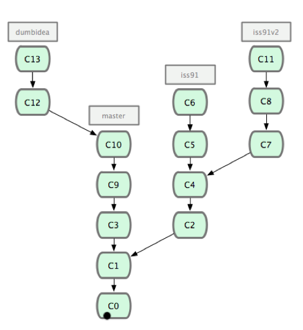

Git Study 03 3.4～3.7
=========

## 3.4 ブランチでの作業の流れ

前回、ブランチとマージの基本操作をやりました。

今回は実際にそれをどう使えばよいかという話し。
- 長期稼働用のブランチ
- トピックブランチ

### 長期稼働用のブランチ

複数のブランチを常にオープンさせておけるGitの特性を活かして、  それぞれのブランチを各開発サイクル用に使う。  
    
- masterブランチに常に安定したコードのみを置き、いつでもリリースできる状態にしておく  
- それ以外に並行してdevelopやnextといった名前のブランチを持ち、 安定性のテストなどにそれらを利用する。  
- developやnextは常に安定している必要はなく、安定した状態になったらmasterにマージする。
- 短期間用にはtopicのようなブランチを作成する。

安定性のレベルに応じて何段階かのブランチを作成し、安定性が一段階上がった時点で  
上位レベルのブランチにマージしていくという考え方。

### トピックブランチ

ブランチの作成、マージ、削除を簡単に行えるGitの特性を活かして、何か特定の機能やそれに関連する作業を行うために使う。

例えば、こんな時  
- masterで何らかの作業中、問題対応のためにiss91ブランチに移動する
- iss91ブランチで作業中、「あ、こっちの方がよかったかも」と新たにiss91v2ブランチを作成
- masterに戻ってしばらく作業中に試したいことができたのでdumbideaブランチを作成

歴史は以下のようになる。

  
