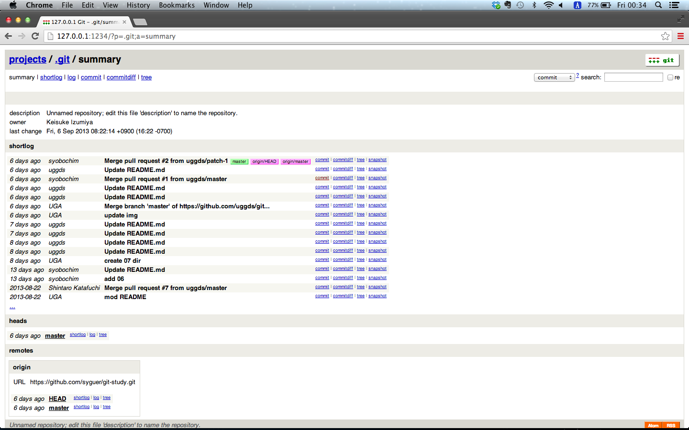
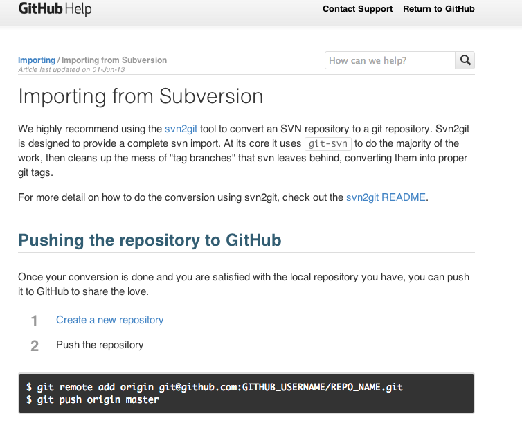

Git Study 08回 4.6~4.11
=========
## 4.6 GitWeb
* gitに標準で付属しているCGIスクリプト


Rubyな人たちは以下のコマンドを叩けば起動する（たぶん）

```sh
$ git instaweb --httpd=webrick
```

ポート1234でブラウザから閲覧可能

停止は下記コマンド

```sh
$ git instaweb --httpd=webrick --stop
```

こんな感じになった




直接ソースを持ってきてWebサーバーにセットすることも可能

```sh
$ git clone git://git.kernel.org/pub/scm/git/git.git $ cd git/
$ make GITWEB_PROJECTROOT="/opt/git" \
prefix=/usr gitweb/gitweb.cgi $ sudo cp -Rf gitweb /var/www/
```
<pre>
<VirtualHost *:80>
  ServerName gitserver
  DocumentRoot /var/www/gitweb
  <Directory /var/www/gitweb>
    Options ExecCGI +FollowSymLinks +SymLinksIfOwnerMatch
    AllowOverride All
    order allow,deny
    Allow from all
    AddHandler cgi-script cgi
    DirectoryIndex gitweb.cgi
  </Directory>
</VirtualHost>
</pre>

CGIに設定したwebサーバーなら動作可能

##4.7 Gitosis

sshでリポジトリを共有する場合
* ‘git’ ユーザーの ~/.ssh/authorized_keysに各自のssh公開鍵追加

大規模プロジェクトで共有する場合

* ***‘git’ ユーザーの ~/.ssh/authorized_keysに各自のssh公開鍵追加／(^o^)＼***

Gitosisはユーザーやアクセスを管理するツール群  

インストール

```
#本体の取得
$ git clone git://eagain.net/gitosis.git
$ cd gitosis

#インストール
$ sudo python setup.py install

#秘密鍵で初期化(サーバーに公開鍵を設置しておく)
$ sudo -H -u git gitosis-init < /tmp/id_dsa.pub

```


Gitosisでは**管理UIがgitリポジトリになっている**

````
$ git clone git@gitserver:gitosis-admin.git
```

中身は以下の感じ

```
$ cd gitosis-admin 
$ find .
  ./gitosis.conf
  ./keydir
  ./keydir/scott.pub
```

これらのファイルを編集してcommit、pushすることで設定の変更が反映される

```:gitosis.conf
[group mobile]
writable = iphone_project 
members = scott josie jessica

[group mobile_ro] 
readonly = iphone_project 
members = john
```

##4.8 Gitolite

リポジトリ、ブランチ、タグ単位で権限の管理が可能

法人や大規模オープンソース開発で重宝

```
$ git clone git://github.com/sitaramc/gitolite
$ cd gitolite/src
$ ./gl-easy-install -q 'GITOLITE_USER' 'HOSTNAME' 'YOUR_NAME'
```

gitolite-adminに変更をpushすることで設定を変更

confの中身
<pre>
repo @oss_repos
RW int$ = @interns
RW eng- = @engineers 
RW refs/tags/rc[0-9] = @engineers 
RW+ = @admins
</pre>

* ログ機能
* $PATH以外のgitをサポート
* アクセス権の報告
* ミラーリング

<pre>
hello sitaram, the gitolite version here is v1.5.4-19-ga3397d4
the gitolite config gives you the following access:
R anu-wsd
R entrans
R W git-notes
R W gitolite
</pre>


##4.9 Git デーモン

読み取り専用のリポジトリならgitプロトコルを用いたほうが高速

gitをデーモン化するには以下のコマンドを実行

```
$ git daemon --reuseaddr --base-path=/opt/git/ /opt/git/
```

※ポート 9418を使う

プロセスをデーモン化する。方法はOSによりけり


##4.10 Git のホスティング

自分で建てるの('A`)ﾏﾝﾄﾞｸｾ


そうだ！ホスティングサービスを使おう！

##4.10.1 GitHub

###4.10.2 ユーザーアカウントの作成
###4.10.3 新しいリポジトリの作成
###4.10.4 Subversion からのインポート

###4.10.5 共同作業者の追加
###4.10.6 あなたのプロジェクト
###4.10.7 プロジェクトのフォーク
###4.10.8 GitHub のまとめ


##4.11 まとめ
個人で立てれば細かく管理できる

面倒ならホスティングを使うべし


##次回は第五章より
