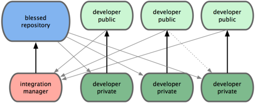
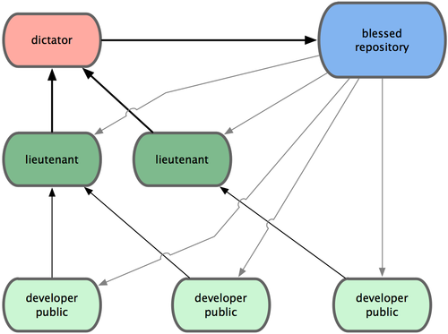
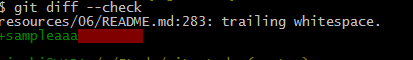

% header  
author:  @syoboshim  
title:   Git Study Part9  
cover : git.jpg  

% slide  
# 第5章の内容
- 5 Git での分散作業
    * 5.1 分散作業の流れ
    * 5.2 プロジェクトへの貢献
    * 5.3 プロジェクトの運営
    * 5.4 まとめ

# 5.1 分散作業の流れ
1. 中央集権型のワークフロー
2. 統合マネージャー型のワークフロー
3. 独裁者と若頭型のワークフロー

# 5.1.1 中央集権型のワークフロー
1. 中央にある一つのハブ(リポジトリ) がコードを受け入れる
2. 他のメンバー全員がそこに作業内容を同期させる
  *（Subversionがこれ）*

# Gitで同様のことをやるには
- 小規模なチームに所属
- 組織内で既に中央集権型のワークフローになじんでいる  
**こういう場合は簡単**  
チームのメンバー全員がマスタにプッシュすればOK

# 5.1.2 統合マネージャー型のワークフロー
やり方をざっくりいうと、  
書き込み権限を持つ公開リポジトリを各自が持ち  
他のメンバーからは読み込みのみのアクセスを許可するという方式  

# 流れ
1. プロジェクトのメンテナーが公開リポジトリにプッシュする  
2. 開発者がそのリポジトリをクローンし、変更を加える  
3. 開発者が各自の公開リポジトリにプッシュする  
4. 開発者がメンテナーに「変更を取り込んでほしい」というメールを送る  
5. メンテナーが開発者のリポジトリをリモートに追加し、それをマージする  
6. マージした結果をメンテナーがメインリポジトリにプッシュする  

# ワークフロー図
  
*（GitHubがこれ）*

# いいところ
- プロジェクトを容易にフォークできる
- プッシュした内容をみんなに簡単に見てもらえる
- メインリポジトリのメンテナーはいつでも好きなタイミングで変更を取り込める
- 変更を取り込んでもらえるまで作業を止めて待つ必要はない

# 5.1.3 独裁者と若頭型のワークフロー
何百人もの開発者が参加するような巨大なプロジェクトで採用されている  
  

# 若頭と独裁者
<ul><li> 若頭(lieutenant)</li></ul>
統合マネージャー(複数人)  
それぞれにリポジトリの特定の部分を担当させる  
<ul><li> 慈悲深い独裁者(benevalent dictator) </li></ul>
すべての若頭をまとめる統合マネージャー

# 流れ
1. 一般の開発者はトピックブランチ上で作業を進め、  
    master の先頭にリベースする。  
    独裁者のmaster ブランチがマスターとなる
2. 若頭が各開発者のトピックブランチを自分のmaster ブランチにマージする
3. 独裁者が各若頭のmaster ブランチを自分のmaster ブランチにマージする
4. 独裁者が自分のmaster をリポジトリにプッシュし、  
    他のメンバーがリベースできるようにする

# ワークフロー図
  

# いい点
一般的ではないが大規模なプロジェクトや高度に階層化された環境では便利  
プロジェクトリーダー(独裁者) が大半の作業を委譲し、  
サブセット単位である程度まとまってからコードを統合することができる  

# 5.2 プロジェクトへの貢献
1. コミットの指針
2. 非公開な小規模のチーム
3. 非公開で管理されているチーム
4. 小規模な公開プロジェクト
5. 大規模な公開プロジェクト

# 5.2.1 コミットの指針
コミットのルールを守ってプロジェクトを進めていこうね。  
仁義あるプロジェクトを目指そう！  

Git プロジェクトでは、パッチの投稿用のコミットを  
作成するときのヒントをまとめたドキュメントを用意しています  
⇒[Documentation/SubmittingPatches](https://github.com/git/git/blob/master/Documentation/SubmittingPatches)  

# 余分な空白文字をいれない
``git diff --check``コマンドを使用することで、  
余分な空白をチェックしてくれる  

# 例）
  
  
コマンド実行結果  
  

# コミットは独立させる
個々の変更内容を把握しやすくする  

別々の問題の修正で同じファイルを変更している場合は  
``git add --patch``を使う  
(一部だけをステージすることができる)  
*詳細は第6章で！！*

# よいコミットメッセージを書く
いい感じのコミットメッセージを書きましょう  
  
**一般的な規則**

- メッセージの最初には変更の概要を一行(50 文字以内)
- その後に空行をひとつ
- より詳しい説明を続ける

# 　　
``git log --no-merges``を実行すれば  
きれいに整形されたプロジェクトの歴史が  
どのように見えるかがわかります。  
  
*コマンドうってみましょう！*

# プロジェクトのタイプ別Gitの使い方
- 5.2.2 非公開な小規模のチーム
- 5.2.3 非公開で管理されているチーム
- 5.2.4 小規模な公開プロジェクト
- 5.2.5 大規模な公開プロジェクト

*それぞれのプロジェクトで、  
どのようにGitを使っていけばいいかの例がのってます*

# 5.2.2～5.2.5に載っている新たなコマンド(1)
``git request-pull [プル先のブランチ] [Gitリポジトリ]``  
プルしてもらいたい変更の概要が出力される  
  
*使用例*  
``
$ git request-pull origin/master myfork
``  
*出力結果はP134をみてね*

# 5.2.2～5.2.5に載っている新たなコマンド(2)
**mergeのオプション**  

- ``--squash``オプション  
  マージしたいブランチでのすべての作業をひとつのコミットにまとめ、  
  それを現在のブランチの先頭にマージ

- ``--no-commit``オプション  
  自動的にコミットを記録しないようGit に指示  

# 　　
*使用例*  
``
$ git merge --no-commit --squash featureB
``

# 5.2.2～5.2.5に載って   いる新たなコマンド(3)
``git format-patch``  
mbox 形式のファイルが作成される  

コミットメッセージの一行目が件名  
残りのコミットメッセージとコミット内容のパッチが本文  
  
format-patch で作成したメールからパッチを適用すると、  
すべてのコミット情報が適切に維持される

# 　　
*使用例*  
``
$ git format-patch -M origin/master
``  
-M スイッチ ... 名前が変わったことを検出するためのもの  
  
*出力結果はP137*  

# 　　
-- の行とパッチの開始位置(lib/simplegit.rb の行) の間に  
メッセージを書くと、  
メールを受信した人はそれを読むことができますが、  
パッチからは除外されます
  
# 　　
メーリングリストへの投稿方法  
[Documentation/SubmittingPatches](https://github.com/git/git/blob/master/Documentation/SubmittingPatches) に  
さまざまなメールソフトでの詳細なメール送信方法が載っている  
  
*※メールソフトの機能(自動改行等)によって  
　フォーマットが勝手に変わらないよう、設定することができる*

# 5.3 プロジェクトの運営
1. トピックブランチでの作業
2. メールで受け取ったパッチの適用
3. リモートブランチのチェックアウト
4. 何が変わるのかの把握
5. 提供された作業の取り込み
6. リリース用のタグ付け
7. ビルド番号の生成
8. リリースの準備
9. 短いログ

# 5.3.1 トピックブランチでの作業
新しい機能を組み込もうと考えている場合は  
トピックブランチを作るのがおすすめ！  
*※トピックブランチ ... 一時的に作るブランチ*  
  
使用コマンド  
ブランチ作成 ... ``$ git branch [ブランチ名] master``  
ブランチ切替 ... ``$ git checkout -b [ブランチ名] master``

# 　　
**いいところ**  
うまくいかなかったときにすぐ戻すことができる！  

※一般的なトピックブランチの名前  
``[作業者名]/[作業内容]``  
  
*例)* ``sc/ruby_client``

# 5.3.2 メールで受け取ったパッチの適用
- apply でのパッチの適用
- am でのパッチの適用

# apply でのパッチの適用(1)
git diff あるいはUnix のdiff コマンドで作ったパッチを  
適用する場合に使用。  
作業ディレクトリ内のファイルを変更する。  
※コミットを作成するわけではない（ステージとコミットが別途必要）  
  
使用コマンド ... ``$ git apply [パッチのフルパス]``  
  
# apply でのパッチの適用(2)
**パッチがちゃんとあたっているか確認することができる**  
  
使用コマンド ... ``$ git apply --check [パッチ名]``  
  
*※きちんと適用されていれば何も表示されない*  
*※チェックに失敗したらゼロ以外の値が返る*  

# am でのパッチの適用(1)
format-patch コマンドを使って作ったパッチを適用する場合に使用。  
  
git send-emailを使用してつくったメールをmbox形式で保存して  
コマンドを使用する。  
※コミットを自動でやってくれる  
  
使用コマンド ... ``$ git am [パッチ名]``  
  
# am でのパッチの適用(2)
**コミット時の情報は自動で取得される！**  

- 作者の情報 ... メールのFrom ヘッダとDate ヘッダ  
- コミットメッセージ ... Subject とメールの本文

# am でのパッチの適用(3)
**パッチの適用に失敗した場合**  

- ログとしてエラーが表示される
- 問題が発生したファイルに衝突マークを書き込まれる

  
ファイルを修正した後に、  
``$ git add [修正ファイル名]``  
``$ git am --resolved``

# am でのパッチの適用(4)
-3 オプションを使うと
