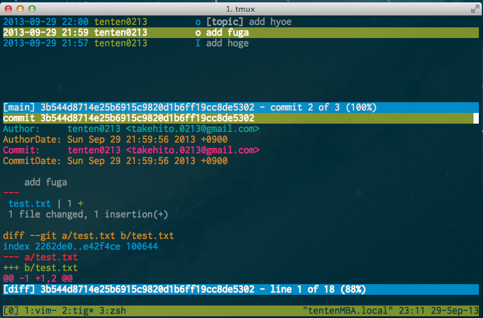

# Git Study 08回 5.3.2 〜
## 5.3.2 メールで受け取ったパッチの適用
### amでのパッチの適用(4)
#### -3オプション
* 3方向のマージをするオプション
* デフォルトでは有効になっていない(らしい)
  * パッチの元になるコミットが手元にないと使えない

```
$ git am -3 0001-seeing-if-this-helps-the-gem.patch Applying: seeing if this helps the gem
error: patch failed: ticgit.gemspec:1
error: ticgit.gemspec: patch does not apply
Using index info to reconstruct a base tree...
Falling back to patching base and 3-way merge... No changes -- Patch already applied.
```

-3オプションがない場合は衝突していたが、-3オプションをつけていたのでうまく取り込まれた。  

Gitは各パッチを順番に適用していく。もし衝突を検知した場合は適用が中止され、手動で衝突を解決する必要がある。


対話的に実行することも可能。たくさんのパッチが含まれるmboxからパッチを適用する際などに利用。パッチが見つかる度に処理を止め、適用するかどうかの確認が求められる。

```
$ git am -3 -i mbox
Commit Body is: --------------------------
seeing if this helps the gem --------------------------
Apply? [y]es/[n]o/[e]dit/[v]iew patch/[a]ccept all
```

「大量にあるパッチについて、内容をまず一通り確認したい」「既に適用済みの パッチは適用しないようにしたい」などの場合に便利。

余談：amは"apply mailbox"の略

[git-am](https://www.kernel.org/pub/software/scm/git/docs/git-am.html)

## 5.3.3 リモートブランチのチェックアウト

ジェシカ「ステキな新機能を作ったから私のリポジトリのruby-clientブランチを見て＼(^o^)／」  
番長「仕方ねーな、見てやるか…('A`)y-~」

```
$ git remote add jessica git://github.com/jessica/myproject.git
$ git fetch jessica
$ git checkout -b rubyclient jessica/ruby-client
```
remote add はherokuやexcale使うときにもしますね！

ジェシカ「前とは違うスバラシイ機能作ったの！(๑╹ڡ╹๑)」  
番長「( ﾟДﾟ)y─┛~~」

別のブランチを伝えられても、リモートに登録しているので、そのブランチをチェックアウトするだけ！  

```
$ git checkout -b hoge jessica/hoge
```

継続的に共同作業する場合はリモートに追加すると便利。  
たまにくるパッチならメールで受け取ったほうが楽。

それでもメールじゃなくGitの形式で取得したい場合は、pullで一度きりの取得を行う。

```
$ git pull git://github.com/onetimeguy/project.git From git://github.com/onetimeguy/project
* branch HEAD -> FETCH_HEAD Merge made by recursive.
```
この場合はリモートを参照するURLは保存されない

## 5.3.4 何が変わるのかの把握

前提：トピックブランチに提供された機能が取り込まれた状態になった  
やりたいこと：トピックブランチのコミットのうち、masterブランチに存在しないコミットを一つ一つ確認する

master ブランチに含まれるコミットを除外するには、ブランチ名の前に --not オプションを指定する。  
たとえば、誰かから受け取った二つのパッチ を適用するために contrib というブランチを作成したとすると、

```
$ git log contrib --not master
commit 5b6235bd297351589efc4d73316f0a68d484f118 Author: Scott Chacon <schacon@gmail.com>
Date: Fri Oct 24 09:53:59 2008 -0700
seeing if this helps the gem
commit 7482e0d16d04bea79d0dba8988cc78df655f16a0 Author: Scott Chacon <schacon@gmail.com>
Date: Mon Oct 22 19:38:36 2008 -0700
updated the gemspec to hopefully work better
```

このトピックブランチを別のブランチにマージした場合の完全なdiffを見たい場合は工夫が必要。
単純にdiff masterするだけでは望んだ結果は得られない。

例えば以下の様な場合


単純にmasterとdiffすると「topicブランチの内容を追加し、masterブランチの追加を削除する」という内容になる。

```
$ git diff master
diff --git a/test.txt b/test.txt
index ad10802..10e8bb2 100644
--- a/test.txt
+++ b/test.txt
@@ -1,2 +1,3 @@
 hoge
 -boyo
 +fuga
 +hyoe
```
本当に知りたいのはトピックブランチで変更された内容、masterにマージした時に加わる内容。  
これを知るには「トピックブランチの最新のコミット」と「トピックブランチとmasterブランチの直近の共通の先祖」とを比較させれば良い。

共通の先祖を見つけ出してdiffを取得するには以下のようにする。

```
$ git merge-base topic master
0eed061d6fde5687af71bf669d443d6ca0116dce
$ git diff 0eed06
diff --git a/test.txt b/test.txt
index 2262de0..10e8bb2 100644
--- a/test.txt
+++ b/test.txt
@@ -1 +1,3 @@
 hoge
 +fuga
 +hyoe
```

これでは面倒なので、手短にやるためにトリプルドット構文が用意されている。

```
$ git diff master...topic
diff --git a/test.txt b/test.txt
index 2262de0..10e8bb2 100644
--- a/test.txt
+++ b/test.txt
@@ -1 +1,3 @@
 hoge
 +fuga
 +hyoe
```
要は、以下の糖衣構文。

```
git diff $(git merge-base master topic) topic
```

## よこみち
前回話していて、Gitのツール類をあまり知らなそうなので紹介。

### GUI Client
#### [SourceTree](http://www.sourcetreeapp.com/)
* Atlassian製のGit＆Mercurial用クライアント
* 最近Windowsでも使えるようになった


Tortoiseにも[TortoiseGit](https://code.google.com/p/tortoisegit://code.google.com/p/tortoisegit/)があるけど、SourceTreeの方が使いやすい。

### CUI
#### [tig](https://github.com/jonas/tig)
* CUIで使うGitブラウザ
* Vimライクなキーバインド
* brewとかyumで一発で入れられるはず
  * WindowsでもCygwin入っていればmake install 出来るはず…



#### [git-flow](https://github.com/nvie/gitflow)
* Vincent Driessenの提唱するブランチモデルを簡単に実現するためのコマンドを提供
* develop,feature,release,hotfixなどブランチを分けて開発するのに便利
  * ぼっち開発者には縁がない(´・ω・`)


#### [hub](https://github.com/github/hub)
* GitHubの操作をCLI上で出来る
* hub browse defunkt/hub
* hub clone defunkt/hub
* hub pull-request
* hub fork

### Vim
#### [vim-fugitive](https://github.com/tpope/vim-fugitive)
* vim上でGit操作が出来る

#### [gitv](https://github.com/gregsexton/gitv)
* vimでのGitブラウザ


