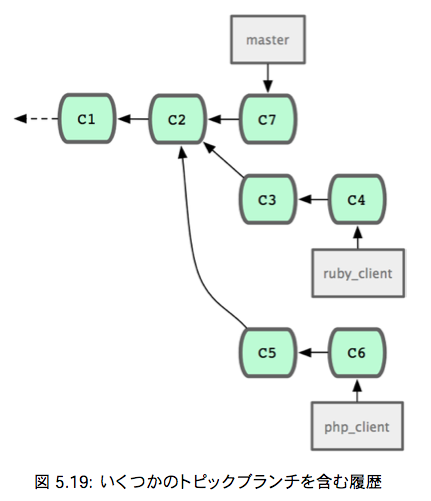
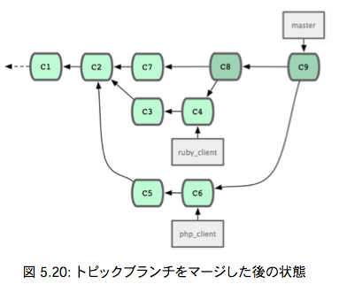
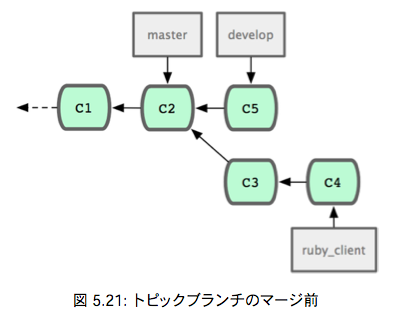
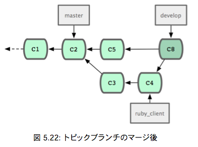
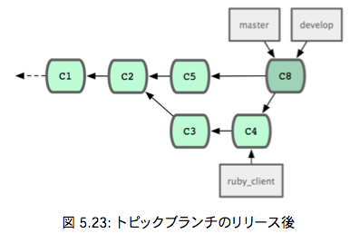
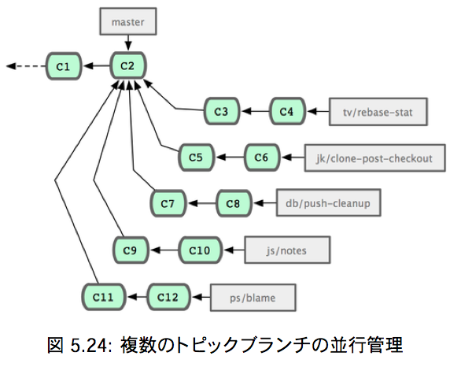
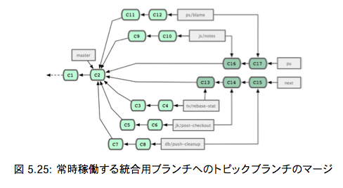
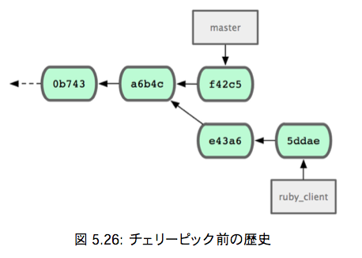
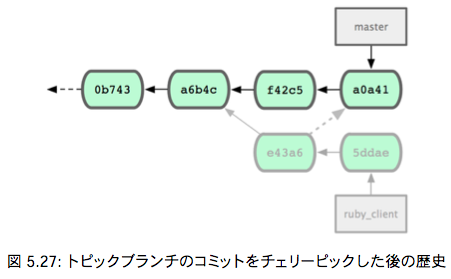

# Git Study 11回 5.3.5 〜
## 5.3.5 提供された作業の取り組み
主な内容：トピックブランチでの作業をメインブランチに取り込む準備ができたらどのように取り込むかを考える。
### マージのワークフロー
シンプルなワークフローのひとつとして、作業を自分の master ブランチに取り込むことを考る。  
master … 安定板のコードを管理するブランチ  
ruby_client … トピックブランチ  
php_client … トピックブランチ  



masterにruby_clientをマージしてから、php_clientをマージすると



これが一番シンプルなマージのワークフローだが、大規模なリポジトリやプロジェクトで作業していると問題が起こるかも。

#### 二段階マージを考える
長期運用用のブランチをmasterとdevelopの２つ用意する。  
master … 安定板のコードを管理するブランチ  
develop … 開発中のコードや、トピックブランチのマージ先となるブランチ

masterが更新されるのは、安定板がリリースされるときのみで、  
新しいコードはすべてdevelopブランチにマージされる流れ。





そして、developブランチが安定していることを確認できたらmasterブランチを先に進める。



#### 大規模マージのワークフロー
Git開発プロジェクトには常時稼働するブランチが４つある。
 - master
 - next … puのマージ先 puで安全であると判断されたらマージされる
 - pu (proposed updates) … 開発途中のソースを管理 不安定
 - maint … メンテナンスリリースに必要なバックポート用のパッチを管理 最新のリリースからフォークしたもの





#### リベースとチェリーピックのワークフロー
マージではなくリベースやチェリーピック（つまみぐい）を使ってmasterの先端につなげていく方法
  
利点：masterブランチをそのまま前に進めることでプロジェクトの歴史をほぼ直線的に進めることができる。

リベース … 3.6参照  
チェリーピック … コミット単位でのリベースのようなもの。  
トピックブランチでいくつかコミットしたうちのひとつだけを統合したい場合などに利用する。



コミット e43a6 を masterブランチに取り込むには、次のようにする。

```sh
$ git cherry-pick e43a6fd3e94888d76779ad79fb568ed180e5fcdf
Finished one cherry-pick.
[master]: created a0a41a9: "More friendly message when locking the index fails."
3 files changed, 17 insertions(+), 3 deletions(-)
```
これで、歴史は以下のようになる。



あとはこのトピックブランチを削除すれば、取り込みたくない変更を消すことできる。

## 5.3.6 リリース用のタグ付け
いよいよリリースする時がきた！  
タグにメンテナの署名を入れたい場合は以下のようにする。

```sh
$ git tag -s v1.5 -m 'my signed 1.5 tag'
You need a passphrase to unlock the secret key for user: "Scott Chacon <schacon@gmail.com>" 1024-bit DSA key, ID F721C45A, created 2009-02-09
```

タグに署名した場合、署名に使用したPGP鍵ペアの公開鍵をどのようにして配布するかが問題になるかも。

