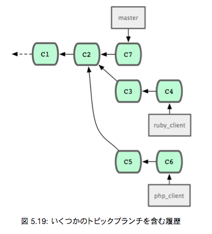

# Git Study 11回 5.3.5 〜
## 5.3.5 提供された作業の取り組み
主な内容：トピックブランチでの作業をメインブランチに取り込む準備ができたらどのように取り込むかを考える。
### マージのワークフロー
シンプルなワークフローのひとつとして、作業を自分の master ブランチに取り込むことを考る。  
master … 安定板のコードを管理するブランチ  
ruby_client … トピックブランチ  
php_client … トピックブランチ  

masterにruby_clientをマージしてから、php_clientをマージすると

これが一番シンプルなマージのワークフローだが、大規模なリポジトリやプロジェクトで作業していると問題が起こるかも。

#### 二段階マージを考える
長期運用用のブランチをmasterとdevelopの２つ用意する。  
master … 安定板のコードを管理するブランチ  
develop … 開発中のコードや、トピックブランチのマージ先となるブランチ

masterが更新されるのは、安定版がリリースされるときのみで、  
新しいコードはすべてdevelopブランチにマージされる流れ。

そして、developブランチが安定していることを確認できたらmasterブランチを先に進める。

