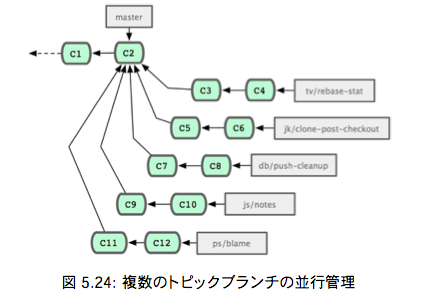
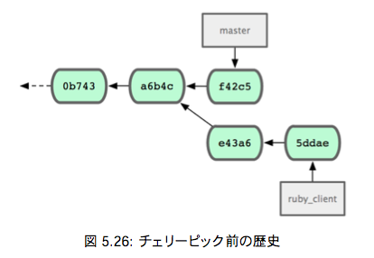

# Git Study 11回 5.3.5 〜
## 5.3.5 提供された作業の取り組み
主な内容：トピックブランチでの作業をメインブランチに取り込む準備ができたらどのように取り込むかを考える。
### マージのワークフロー
シンプルなワークフローのひとつとして、作業を自分の master ブランチに取り込むことを考る。  
master … 安定版のコードを管理するブランチ  
ruby_client … トピックブランチ  
php_client … トピックブランチ  


masterにruby_clientをマージしてから、php_clientをマージすると


これが一番シンプルなマージのワークフローだが、大規模なリポジトリやプロジェクトで作業していると問題が起こるかも。

#### 二段階マージを考える
長期運用用のブランチをmasterとdevelopの２つ用意する。  
master … 安定版のコードを管理するブランチ  
develop … 開発中のコードや、トピックブランチのマージ先となるブランチ

masterが更新されるのは、安定板がリリースされるときのみで、  
新しいコードはすべてdevelopブランチにマージされる流れ。


そして、developブランチが安定していることを確認できたらmasterブランチを先に進める。


#### 大規模マージのワークフロー
Git開発プロジェクトには常時稼働するブランチが４つある。
 - master
 - next … puのマージ先 puで安全であると判断されたらマージされる
 - pu (proposed updates) … 開発途中のソースを管理 不安定
 - maint … メンテナンスリリースに必要なバックポート用のパッチを管理 最新のリリースからフォークしたもの




#### リベースとチェリーピックのワークフロー
マージではなくリベースやチェリーピック（つまみぐい）を使ってmasterの先端につなげていく方法
  
利点：masterブランチをそのまま前に進めることでプロジェクトの歴史をほぼ直線的に進めることができる。

リベース … 3.6参照  
チェリーピック … コミット単位でのリベースのようなもの。  
トピックブランチでいくつかコミットしたうちのひとつだけを統合したい場合などに利用する。



コミット e43a6 を masterブランチに取り込むには、次のようにする。

```sh
$ git cherry-pick e43a6fd3e94888d76779ad79fb568ed180e5fcdf
Finished one cherry-pick.
[master]: created a0a41a9: "More friendly message when locking the index fails."
3 files changed, 17 insertions(+), 3 deletions(-)
```
これで、歴史は以下のようになる。


あとはこのトピックブランチを削除すれば、取り込みたくない変更を消すことできる。

## 5.3.6 リリース用のタグ付け
いよいよリリースする時がきた！  
タグにメンテナの署名を入れたい場合は以下のようにする。

```sh
$ git tag -s v1.5 -m 'my signed 1.5 tag'
You need a passphrase to unlock the secret key for user: "Scott Chacon <schacon@gmail.com>" 1024-bit DSA key, ID F721C45A, created 2009-02-09
```

タグに署名した場合、署名に使用したPGP鍵ペアの公開鍵をどのようにして配布するかが問題になる可能性がある。

解決法  
① 公開鍵をblobとしてリポジトリに含める  
② それを直接指すタグを追加する  

①でまずどの鍵を使うかを決めるためにpg --list-keysを実行する。  
```sh
$ gpg --list-keys
/Users/schacon/.gnupg/pubring.gpg
---------------------------------
pub 1024D/F721C45A 2009-02-09 [expires: 2010-02-09]
uid           Scott Chacon <schacon@gmail.com>
sub 2048g/45D02282 2009-02-09 [expires: 2010-02-09]
```
鍵をGitデータベースにインポートするには、鍵をエクスポートしてそれをパイプでgit hash-objectに渡す。  
鍵の中身を新しいblobとしてGitに書き込み、そのblobのSHA-1を返す。
```sh
$ gpg -a --export F721C45A | git hash-object -w --stdin
659ef797d181633c87ec71ac3f9ba29fe5775b92
```
鍵の中身をGitに取り込めたので、この鍵を直接するタグを作成できるようになった。  
hash-objectコマンドで知ったSHA-1値を指定すればよい。
```sh
$ git tag -a maintainer-pgp-pub 659ef797d181633c87ec71ac3f9ba29fe5775b92
```
git push --tagsを実行すると、maintainer-pgp-pubタグをみんなと共有できるようになる。  
誰かがタグを検証したい場合は、PGP鍵が入ったblobをデータベースから直接プルで取得し、  
それをPGPにインポートする。
```sh
$ git show maintainer-pgp-pub | gpg --import
```
この鍵をインポートした人は、署名したすべてのタグを検証できるようになった。  
タグのメッセージに検証手順の説明を含めておけば、git show <tag>でエンドユーザ向けに詳しい検証手順を示すことができる。

## 5.3.7 ビルド番号の生成
Gitではコミットごとに'v123'のような単調な番号を振っていくことはない。  
もし特定のコミットに対して人間がわかりやすい名前が欲しければ、そのコミットに対してgit describeを実行する。  
  
Gitはそのコミットに最も近いタグの名前とそのタグからのコミット数、そしてそのコミットのSHA-1値の一部を使った名前を作成する。
```sh
$ git describe master
v1.6.2-rc1-20-g8c5b85c
```
これでスナップショットやビルドを公開するときにわかりやすい名前をつけられるようになる。  

## 5.3.8 リリースの準備
リリースするにあたって、最新のスナップショットのアーカイブを作る。  
Gitを使っていない可哀想な人たちにもコードを提供するために。。(p152抜粋）  
  
その際に使用するコマンドはgit archive。
```sh
$ git archive master --prefix='project/' | gzip > `git describe master`.tar.gz
$ ls *.tar.gz
v1.6.2-rc1-20-g8c5b85c.tar.gz
```
tarballを開けば、プロジェクトのディレクトリの下に最新のスナップショットが得られる。  
まったく同じ方法でzipアーカイブを作成することもできる。  
この場合はgit archiveで --format=zipオプションを指定する。
```sh
$ git archive master --prefix='project/' --format=zip > `git describe master`.zip
```
## 5.3.8 短いログ
そろそろメーリングリストにメールを送り、プロジェクトに何が起こったのかをみんなに知らせよう！  
前回のリリースから何がかわったのかの変更履歴を手軽に取得するにはgit shortlogコマンドを使う。  
  
たとえば、直近のリリースの名前がv1.0.1だった場合は、次のようにすると前回のリリース以降のすべてのコミットの概要が得られる。  
```sh
$ git shortlog --no-merges master --not v1.0.1 
Chris Wanstrath (8):
    Add support for annotated tags to Grit::Tag
    Add packed-refs annotated tag support. Add Grit::Commit#to_patch
    Update version and History.txt
    Remove stray `puts`
    Make ls_tree ignore nils
    
Tom Preston-Werner (4):
    fix dates in history
    dynamic version method
    Version bump to 1.0.2
    Regenerated gemspec for version 1.0.2
```
v1.0.1以降のすべてのコミットの概要が、作者別にまとめて得られた！

# 5.4 まとめ
おめでとうございます。Gitを使いこなせる開発者の仲間入りです！
