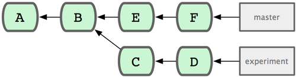

# Git のさまざまなツール
Git の非常に強力な機能の数々をさらに探っていきましょう!!

## 6.1 リビジョンの選択
特定のコミットやコミットの範囲を指定する方法

### 6.1.1 単一のリビジョン
SHA-1 ハッシュを指定すれば、コミットを明確に参照することができる  
でも、もっと簡単に、わかりやすい感じでコミットを参照することもできる！  
単一のコミットを参照するための、方法について紹介していくよ！

### 6.1.2 SHA の短縮形

Git は、最初の数文字をタイプしただけであなたがどのコミットを指定したいのかを汲み取ってくれます  

そのための条件  

- SHA-1 の最初の4 文字以上を入力していること
- ひとつのコミットが特定できること

```
$ git log
```

でcommitの一覧が出るので、

```
$ git show xxxx
```
*※xxxx はSHA-1の短縮系*  
をうってみましょう！  
xxxxが条件に当てはまっていれば、コミットの情報を参照できます！  
  
条件にあてはまるSHA-1の短縮系を表示させることもできる！

```
$ git log --abbrev-commit
```
コマンドをうってみましょう！  
「--abbrev-commit」オプションはコミットを一意に特定できる範囲の省略形で出力する。  
デフォルトでは7文字分表示するが、それだけでSHA-1 を特定できない場合はどんどん長くなる


### 6.1.3 SHA-1 に関するちょっとしたメモ
もしSHA-1ハッシュタグが同一のコミットが存在したら、  
先に実施したコミットが優先されて、後のコミットが無視されてしまう。  
でも、そんな確率は、  
「あなたの所属する開発チームの全メンバーが、同じ夜にそれぞれまったく無関係の事件で全員オオカミに殺されてしまう」可能性よりも低いよ。  
ってはなし。

### 6.1.4 ブランチの参照
ブランチを指定してコミットを参照することもできる！  
たとえば、topic1 ブランチがあるコミットを示している場合は、

```
$ git show topic1
```
*※topc1はブランチ名*  
のコマンドを使用して、コミットに関する情報を参照することができる！  
  
ブランチがどのSHAを指しているか調べることもできる！  
使用するコマンドはこれ！

```
$ git rev-parse topic1
```
*※topc1はブランチ名*  


### 6.1.5 参照ログの短縮形

**参照ログ**  
HEAD とブランチの参照が過去数ヶ月間どのように動いてきたかを表すもの  
  
参照するためには、↓のコマンドを使用します！

```
git reflog
```

何らかの理由でブランチの先端が更新されるたびに、Git の情報をこの一時履歴に格納します。  
何個か前のHEADの状態を知りたいときは、@{n} 形式で参照することができます。

```
$ git show HEAD@{3}
```

↑3個前の状態を知りたいとき  
  
この構文を使うと、指定した期間だけさかのぼったときに特定のブランチがどこを指していたかを知ることもできます。  
  
たとえばmaster ブランチの昨日の状態を知りたいときは、

```
$ git show master@{yesterday}
```

コマンドで参照することができます！  
  
**注意!!**
この技が使えるのは参照ログにデータが残っている間だけなので、  
直近数ヶ月よりも前のコミットについては使うことができません。  
  
参照ログの情報をgit log の出力風の表記で見るにはgit log -g を実行します。

```
$ git log -g master
```

参照ログの情報は、完全にローカルなものであることに気をつけましょう。  
同じリポジトリをコピーした別の人の参照ログとは異なる内容になります。  
また、最初にリポジトリをクローンした直後の参照ログは空となります。  
  
git showHEAD@{2.months.ago} が動作するのは、  
少なくとも二ヶ月以上前にそのリポジトリをクローンした場合のみで、  
もしつい5 分前にクローンしたばかりなら何も結果を返しません。


### 6.1.6 家系の参照

いい感じに出力してくれる！萌えコマンド！！  

```
git log --pretty=format:'%h %s' --graph
```

  
  
参照の最後に̂ をつけると、Git はそれを「指定したコミットの親」と解釈します。  
直前のコミットを見るにはHEAD̂ を指定します。これは『HEAD の親』という意味になります。  
  

```
git show HEAD^
```

̂ の後に数字を指定することもできます。たとえばd921970̂2 は『d921970 の二番目の親』という意味になります。  
  
『~』も最初の親を指します。  
つまりHEAD~ とHEAD̂ は同じ意味になります。  
違いが出るのは、数字を指定したときです。  
HEAD~2 『最初の親の最初の親』つまり『祖父母』という意味になります。  
指定した数だけ、順に最初の親をさかのぼっていくことになります。  
  
これはHEAD̂̂̂̂̂̂ のようにあらわすこともできます。  
これは「最初の親の最初の親の最初の親」という意味になります。  
  
これらふたつの構文を組み合わせることもできます。  
直近の参照(マージコミットだったとします) の二番目の親を取得するにはHEAD~3̂2 などとすればいいのです。  

### 6.1.7 コミットの範囲指定

コミットの範囲を指定する方法を覚えていきましょう。  
  
  
**ダブルドット**  
範囲指定の方法としてもっとも一般的なのが、ダブルドット構文です。  
ひとつのコミットからはたどれるけれど  
もうひとつのコミットからはたどれないというコミットの範囲をGitに調べさせるものです。  
  
<<A>>になくて<<B>>にあるものを出力するコマンド

```
git log <<A>>..<<B>>
```




  
experiment ブランチの内容のうち、まだmaster ブランチにマージされていないものを調べることになりました。  
対象となるコミットのログを見るには、Git にmaster..experiment と指示します。  
これは『experiment からはたどれるけれど、master からはたどれないすべてのコミット』という意味です。  
説明を短く簡潔にするため、  
実際のログの出力のかわりに上の図の中でコミットオブジェクトをあらわす文字を使うことにします。  

```
$ git log master..experiment
D
C
```

もし逆に、master には存在するけれどもexperiment には存在しないすべてのコミットが知りたいのなら  
↓のようにすればいい  

```
$ git log experiment..master
F
E
```

「experiment ブランチに今足りないもの」を簡単に表示させることができる!!  
これは、experiment ブランチを最新の状態に保つために何をマージしなければならないのかを知るのに便利  
  
これからリモートにプッシュしようとしている内容を知りたいときにも便利!!  

```
$ git log origin/master..HEAD
```

このコマンドは、現在のブランチ上でのコミットのうち、  
リモートorigin のmaster ブランチに存在しないものすべてを表示します。  
  
現在のブランチがorigin/master を追跡しているときにgit push を実行すると、  
git log origin/master..HEAD で表示されたコミットがサーバーに転送されます。  
このコマンドは、どちらか片方を省略することもできます。  
省略した場合、Git は省略したほうをHEAD とみなします。  
たとえば、git log origin/master.. と入力すると、$ git log origin/master..HEADと同じ結果になります。  
Git は、省略した側をHEAD に置き換えて処理を進めるのです。  
  
  
** 複数のポイント **  
  
二つよりもっと多くのブランチを指定してリビジョンを特定したいときは  
^ 文字または--notを使用する  
  
*※--notはその場所からたどり着ける、コミットが不要な参照を見ることができる*  
  

```
$ git log refA..refB
$ git log ^refA refB
$ git log refB --not refA
```

3 つのコマンドは同じ意味になります。  
そして、これをつなげていくことで、3つ以上の参照を条件に加えることができる！  
たとえば、、refA とrefB のどちらかからはたどれるけれどもrefC からはたどれないコミットを取得したい場合  

```
$ git log refA refB ^refC
$ git log refA refB --not refC
```

  
  
** トリプルドット **
  
ふたつの参照のうちどちらか一方からのみたどれるコミット(つまり、両方からたどれるコミットは含まない) を指定する方法  
  


masterあるいはexperiment に存在するコミットのうち、両方に存在するものを除いたコミットを知りたい場合  

```
$ git log master...experiment
F
E
D
C
```

これは通常のlog の出力と同じですが、これら四つのコミットについての情報しか表示しません。  
表示順は、従来どおりコミット日時順となります。  
この場合にlog コマンドでよく使用するスイッチが--left-right です。  
このスイッチは、それぞれのコミットがどちら側に存在するのかを表示します。  

```
$ git log --left-right master...experiment
< F
< E
> D
> C
```

これらのツールを使えば、より簡単に「どれを調べたいのか」をGit に伝えられるようになります。